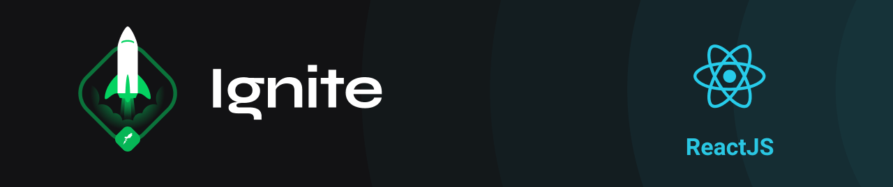

<h3 align="center">
  First application with ReactJS: DT Money 
</h3>

  
  
  
  

  <a href="#rocket-about">About</a>&nbsp;&nbsp;&nbsp;|&nbsp;&nbsp;&nbsp;
  <a href="#technologies">Technologies</a>&nbsp;&nbsp;&nbsp;|&nbsp;&nbsp;&nbsp;
  <a href="#installation">Installation</a>&nbsp;&nbsp;&nbsp;|&nbsp;&nbsp;&nbsp;
  <a href="#memo-license">License</a>

 

---

## :rocket: About

In this module, a complete web front-end application, **DT Money**, was built, using important ecosystem concepts and tools.

## Technologies

- [ReactJS](https://reactjs.com/)
- [React Modal](https://github.com/reactjs/react-modal)
- [Typescript](https://www.typescriptlang.org/)
- [MirajeJS](https://miragejs.com/)
- [Styled Components](https://styled-components.com/)
- [Axios](https://github.com/axios/axios)

## Installation

1. Clone the repository: `git@github.com:matheus-neves/dtmoney.git`
2. Access the directory: `cd dtmoney`
3. Install the dependencies: `yarn`
4. Run the app: `yarn start`

## :memo: License

This challenge is under license from MIT. See the archive [LICENSE](https://github.com/matheus-neves/dtmoney/blob/main/LICENSE) for more details.

---

Challenge completed :heavy_check_mark:

Made with 💜 &nbsp; by Matheus Neves [See my linkedin!](https://www.linkedin.com/in/matheus-neves-front-end/) :wave:
